<div align="center">



### Software Tester • Automation QA Engineer • SDET / Quality Engineering Path

I build reliable, maintainable test automation and quality practices across **web, API, data, and performance testing**.

[](https://github.com/MahmodHelal)
[](#)

</div>

---

## 👋 About Me

I’m **Mahmoud Helal**, a Software Testing Engineer and Automation QA Engineer with experience in **real-world application testing, defect investigation, test automation, and software testing training**.

My current direction is:

**Software Testing → Automation QA → SDET / Quality Engineering**

I enjoy turning business requirements into dependable test coverage, investigating defects, building maintainable automation, and making quality visible throughout the delivery lifecycle.

## 💼 Professional Experience

### Software Testing Engineer — SYAD

I work on real-world applications and e-services, with a strong focus on **functional quality, business workflows, regression, defect investigation, and production support**.

- Test business-critical workflows across **electronic lottery, Madinty, grants, and GIS-related applications**.
- Design and execute test cases for positive, negative, regression, system, and end-to-end scenarios.
- Investigate reported issues, reproduce defects, document findings, and communicate actionable results to development teams.
- Validate fixes and perform regression testing to reduce the risk of introducing new defects.
- Support production-related issues by analyzing reported behavior and helping identify the affected workflow or functionality.
- Work with business requirements and acceptance criteria to verify that delivered functionality behaves as expected.
- Apply practical QA techniques across web applications, data validation, API-oriented testing, and defect lifecycle management.

**Focus:** Production Quality • Functional Testing • Regression Testing • Defect Investigation • Business Workflow Validation • GIS / E-Service Applications

## 🧰 Core Toolkit

| Area | Tools & Technologies |
|---|---|
| UI Automation | Java, Selenium WebDriver, TestNG, Cucumber, POM |
| API Testing | Postman, Newman |
| Database | SQL, MySQL, database validation |
| Performance | JMeter, Locust |
| Build & Version Control | Maven, Git, GitHub |
| Quality | ISTQB CTFL v4.0, functional, regression, system & acceptance testing |
| Test Management | Jira, Xray, Azure DevOps |

## ⭐ Featured Portfolio

### 🔹 CRM Automation Test Suite
**Java • Selenium • TestNG • Cucumber • Maven • POM**

A maintainable UI automation suite designed around critical CRM workflows, reusable Page Objects, test data, assertions, synchronization, and parallel execution.

➡️ **[View CRM-Automation-Test](https://github.com/MahmodHelal/CRM-Automation-Test)**

### 🔹 Royal Grant Automation
**Java • Selenium • Cucumber • TestNG • Maven**

A practical automation project representing a multi-role business workflow with reusable automation components, reporting, and regression-oriented scenarios.

➡️ **[View Royal-Grant-Automation](https://github.com/MahmodHelal/Royal-Grant-Automation)**

### 🔹 nopCommerce E-Commerce Automation
**Java • Selenium • Cucumber • TestNG • Maven**

A BDD-oriented UI automation project covering core e-commerce journeys including registration, product search, shopping cart, and checkout.

➡️ **[View Amit_52proj](https://github.com/MahmodHelal/Amit_52proj)**

### 🔹 CV & Professional Profile
➡️ **[View Helal_Tester_CV](https://github.com/MahmodHelal/Helal_Tester_CV)**

## 🧪 Testing Mindset

```text
Requirements
    ↓
Test Analysis
    ↓
Test Design
    ↓
Manual Validation
    ↓
Automation
    ↓
API / Database / Performance Checks
    ↓
Defect Analysis
    ↓
Regression & CI
    ↓
Continuous Quality Improvement
```

I aim to automate the **right** checks—not simply automate everything.

## 🚀 Currently Growing

- Playwright + TypeScript
- Modern web automation practices
- API automation with REST Assured / Newman
- CI/CD with GitHub Actions
- Performance testing with JMeter / Locust
- AI-assisted testing and automation workflows
- SDET-oriented automation architecture

## 📜 Certification

**ISTQB Certified Tester — Foundation Level (CTFL) v4.0**

## 📌 Engineering Principles

- **Readable tests over clever tests**
- **Stable locators over fragile selectors**
- **Reusable components over duplicated steps**
- **Meaningful assertions over excessive assertions**
- **Fast feedback over slow feedback loops**
- **Quality as a team responsibility**

## 📫 Let's Connect

I’m interested in opportunities and collaborations around **Software Testing, Automation QA, SDET, and Quality Engineering**.

> Building better software starts with making quality measurable, repeatable, and actionable.

---

<div align="center">

**Mahmoud Helal** · Software Tester | Automation QA Engineer

</div>
